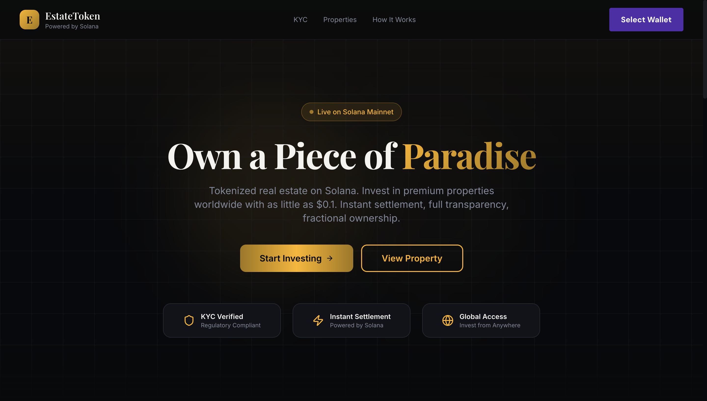
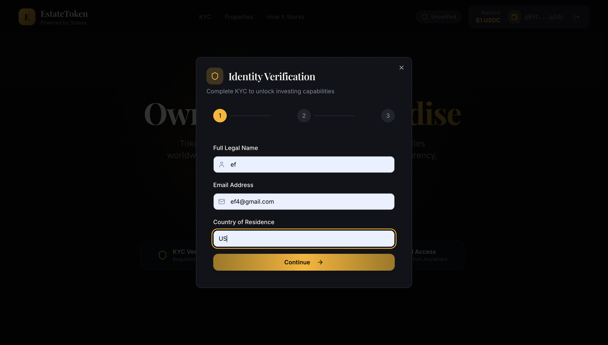
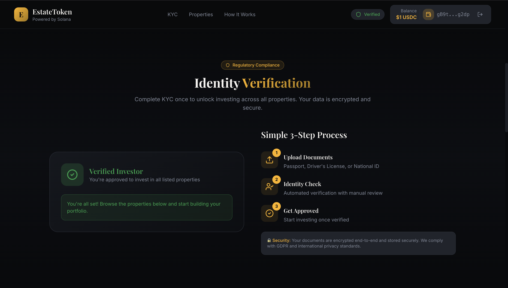
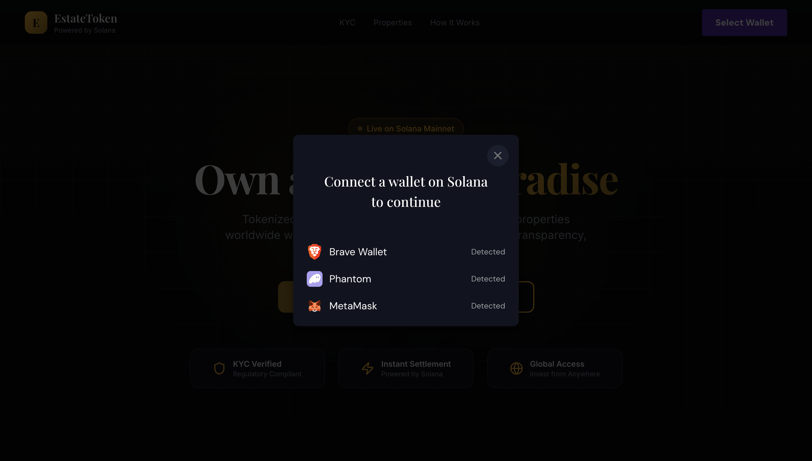

# 🏠 Estate Tokens – Tokenizing Real-World Assets on Solana

Estate Tokens is a decentralized platform that enables tokenization of Real World Assets (RWAs), allowing users to mint fractional ownership tokens (shares) of real estate properties across the globe.

Our mission: **Make global real-estate investing accessible, transparent, and permissionless.**

---

## 🚀 How It Works

1. **Connect Wallet**
   Users connect their Solana wallet to the platform.

2. **Complete KYC Verification**
   Users upload KYC details and submit them for verification.

3. **Buy Property Shares**
   Once verified, users can mint estate tokens (fractional shares) of verified properties and later sell them for potential profit.

---

## 🔧 Technical Overview

### **1. Solana Program**

The Estate Token smart contract is written in **Rust using Anchor**, fully tested and audited.

📌 **Deployed on Solana Devnet:**

```bash
2SLgYEkzcZfHeZqhssWJSxC4w8pyLheFjj275z1QtYXY
```

The program handles:

- PDA-based user share accounts
- Minting property shares
- Property-specific validation
- Secure and constraint-checked logic

---

### **2. Frontend**

Built with:

- **React / Next.js**
- **Solana Wallet Adapter**
- **@solana/web3.js**
- **x402-solana** for streamlined payment execution

#### ▶️ Run the frontend

```bash
npm install
npm run dev
```

---

### **3. Backend**

The backend integrates the x402 protocol, enabling:

- Secure transaction processing
- Payment validations
- Transaction status confirmation before minting tokens

> Environment variables

```bash
TREASURY_WALLET_ADDRESS=gB9tAA...dg2dp
```

#### ▶️ Run the frontend

```bash
npm install
npm run dev
```

## 📸 Screenshots

### Home Page



### Property Listing


### KYC Page



### Verified KYC



### Connect Wallet


